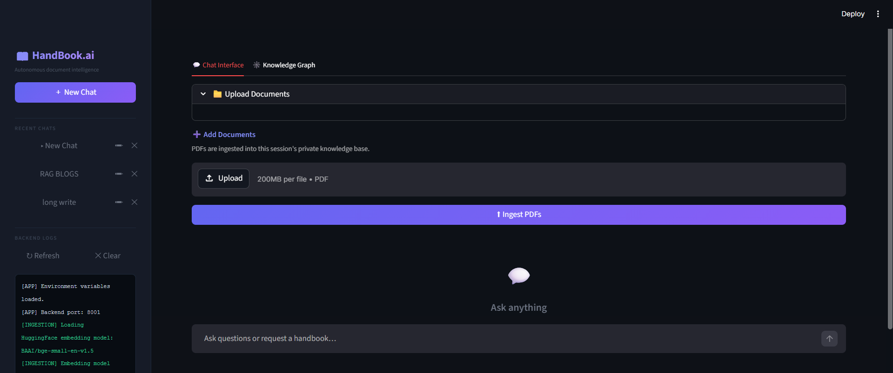
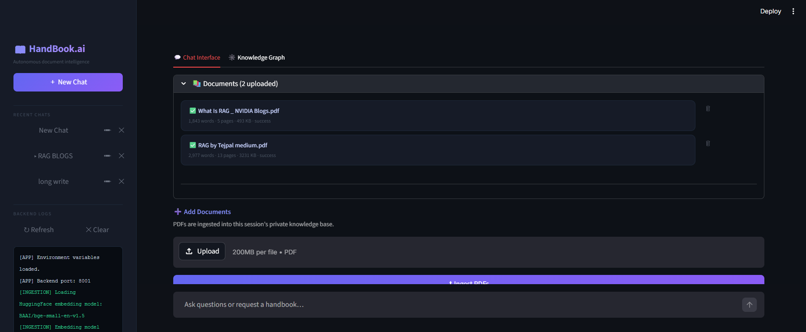
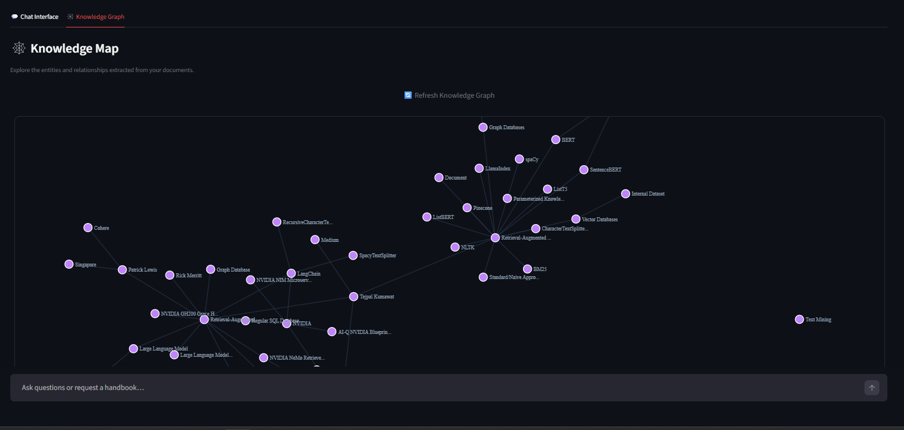

# 📘 HandBook.ai

**HandBook.ai** is an autonomous document intelligence platform that escapes the "short-answer gravity" of standard LLMs. Built on the principles of the pioneering research **"LongWriter: Unleashing 10,000+ Word Generation from Long Context LLMs"** (Tsinghua University & Zhipu AI), it specializes in generating exhaustive, high-quality handbooks from your PDFs without losing context, structure, or depth.

---

## 🚀 Key Features

- **Long-Form Mastery**: Generate content exceeding 10,000 words with coherent structure and deep technical grounding.
- **Context-Aware RAG**: Uses **LightRAG** and Knowledge Graphs to maintain cross-document context.
- **Dynamic Knowledge Mapping**: Visualise relationships extracted from your documents in an interactive Knowledge Map.
- **Tiered Intelligence**: Leverages GPT-4o for premium writing and GPT-4o-mini for high-volume graph extraction.

---

## 🛠️ Tech Stack

| Component | Technology |
|---|---|
| **Frontend** | Streamlit |
| **Backend** | FastAPI (Python) |
| **Database** | Supabase (PostgreSQL + `pgvector`) |
| **RAG Engine** | LightRAG (Knowledge Graph + Vector) |
| **Embeddings** | Local HuggingFace (BGE-Small) |
| **LLMs** | OpenAI GPT-4o & GPT-4o-mini |

---

## 📸 Visuals

### 1. Unified Chat Interface

*A clean, conversational interface for uploading documents and generating handbooks.*

### 2. Multi-Document Ingestion

*Batch ingest multiple PDFs into a session-specific private knowledge base.*

### 3. Knowledge Map

*Interactive Knowledge Graph visualizing the entities and relationships extracted from your data.*

---

## ⚡ Setup & Installation

### 1. Prerequisites
- Python 3.10+
- A Supabase account with `pgvector` enabled.
- OpenAI API Key.

### 2. Installation
```powershell
# Clone the repository
git clone https://github.com/your-username/handbook-ai.git
cd handbook-ai

# Create and activate virtual environment
python -m venv venv
.\venv\Scripts\activate

# Install dependencies
pip install -r requirements.txt
```

### 3. Environment Configuration
Create a `.env` file in the root directory:
```env
# Supabase Database
POSTGRES_HOST=your_db_host.supabase.co
POSTGRES_PORT=5432
POSTGRES_USER=postgres
POSTGRES_PASSWORD=your_password
POSTGRES_DATABASE=postgres

# Supabase API
SUPABASE_URL=https://your_project.supabase.co
SUPABASE_SERVICE_KEY=your_key

# LLM
OPENAI_API_KEY=sk-your-openai-key
```

---

## 🏃 Running the Application

1. **Start the Backend (FastAPI)**:
   ```powershell
   .\venv\Scripts\uvicorn app:app --reload --port 8001
   ```

2. **Start the Frontend (Streamlit)**:
   ```powershell
   .\venv\Scripts\python -m streamlit run ui.py
   ```

3. Open your browser and navigate to `http://localhost:8501`.

---

## 🎓 Research Foundation

HandBook.ai's generation engine is inspired by and built upon the methodologies described in:
> **LongWriter: Unleashing 10,000+ Word Generation from Long Context LLMs**  
> *Yushi Bai, Jiajie Zhang, Xin Lv, Linzhi Zheng, Siqi Zhu, Lei Hou, Yuxiao Dong, Jie Tang, Juanzi Li*  
> Tsinghua University & Zhipu AI

---

*HandBook.ai — Document intelligence at scale.* 🚀
